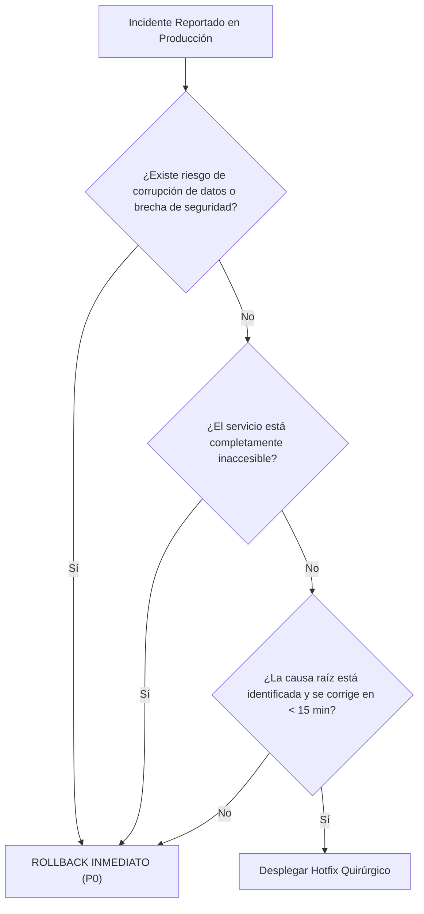

# 🚨 Procedimientos de Reversión en Producción (Rollback Playbook) — La Veinte Digital

> **Última actualización:** 2026-09-10  
> **Ámbito:** Vercel (Web), Supabase (PostgreSQL), Android (Google Play & Sideload), iOS (App Store)  
> **Objetivo permanente:** Restauración inmediata del servicio, cero pérdida de datos de trabajadores y mitigación de incidentes con mínima fricción operativa.

---

## 1. Clasificación de Severidad y Matriz de Decisión (Hotfix vs. Rollback)

### Niveles de Severidad
- **P0 (Crítico)**:
  - Falla total de autenticación, indisponibilidad del servicio web, corrupción activa de datos laborales o brecha de seguridad.
  - *Tiempo objetivo de respuesta (TTR)*: < 15 minutos.
  - *Acción predeterminada*: **Rollback inmediato** al despliegue estable previo.
- **P1 (Mayor)**:
  - Disfunción en una funcionalidad central (e.g. importador de tarjetones falla para todos los usuarios, cálculo de aguinaldo erróneo, asistente virtual indisponible).
  - *Tiempo objetivo de respuesta*: < 1 hora.
  - *Acción predeterminada*: Rollback si el diagnóstico toma > 20 minutos; si la corrección es de 1 línea evidente, hotfix quirúrgico.
- **P2 (Menor)**:
  - Defectos visuales menores, inconsistencias en textos de ayuda, lentitud en consultas secundarias.
  - *Tiempo objetivo de respuesta*: Mismo día o siguiente sprint.
  - *Acción predeterminada*: Corrección estándar mediante pull request en el ciclo normal.

### Árbol de Decisión


---

## 2. Reversión en Vercel (Aplicación Web y APIs)

Vercel mantiene despliegues inmutables (*immutable deployments*). La reversión a nivel web es instantánea y no requiere reconstruir paquetes.

### A. Reversión Instantánea vía Vercel CLI
```bash
# 1. Identificar el despliegue previo estable
npx vercel list --prod

# 2. Revertir el tráfico instantáneamente al despliegue anterior
npx vercel rollback <DEPLOYMENT_URL_OR_ID>

# Ejemplo:
# npx vercel rollback dpl_previous_good_deployment
```

### B. Reversión vía Dashboard Web de Vercel
1. Ingresar a: `https://vercel.com/chronosbvrx/la-veinte-digital/deployments`.
2. Ubicar el último despliegue con estado **Production** que operaba sin fallas.
3. Hacer clic en los tres puntos (`...`) junto al despliegue.
4. Seleccionar **Instant Rollback**.
5. Confirmar en el cuadro de diálogo. El tráfico de borde (*Edge Network*) conmutará en menos de 5 segundos.

### C. Reversión de Variables de Entorno en Vercel
Si el incidente se debió a una clave o URL de entorno incorrecta:
1. `Settings` → `Environment Variables`.
2. Restaurar el valor correcto.
3. Ejecutar `npx vercel --prod` o redeplegar el commit estable para que el nuevo entorno surta efecto.

---

## 3. Reversión en Supabase (Base de Datos PostgreSQL)

### Política Suprema de Migraciones: **Forward-Only vs. Down Migrations**
1. **Regla de Oro**: En bases de datos de producción con trabajadores reales, **las migraciones son preferentemente Forward-Fix (adelante)**.
2. **Prohibido**: Ejecutar `DROP TABLE`, `DROP COLUMN` o `TRUNCATE` en caliente sin respaldo previo verificado.
3. Si una migración creó una función o vista defectuosa, se aplica una nueva migración que restaure la definición anterior mediante `CREATE OR REPLACE FUNCTION`.

### Reversión de Migraciones del Hardening (Ejemplo: `20260910200000_harden_security_definer_functions.sql`)
Si fuera estrictamente necesario revertir el endurecimiento de `clean_commitment_reminders_on_update()`:
```sql
-- Script de contingencia:
CREATE OR REPLACE FUNCTION public.clean_commitment_reminders_on_update()
RETURNS trigger
LANGUAGE plpgsql
SECURITY DEFINER
AS $function$
BEGIN
  IF NEW.status IN ('completed', 'cancelled') AND (OLD.status IS NULL OR OLD.status NOT IN ('completed', 'cancelled')) THEN
    DELETE FROM public.agenda_reminders
    WHERE commitment_id = NEW.id;
  END IF;
  RETURN NEW;
END;
$function$;

GRANT EXECUTE ON FUNCTION public.clean_commitment_reminders_on_update() TO PUBLIC;
```

### Procedimiento de Recuperación a Punto en el Tiempo (PITR — Point-in-Time Recovery)
En caso de pérdida catastrófica de datos:
1. Ir al panel de Supabase: `https://supabase.com/dashboard/project/ragktminwduiggvaoeix/settings/database`.
2. Sección **Backups** → **Point in time recovery (PITR)**.
3. Seleccionar el timestamp exacto (UTC) previo al evento corruptor.
4. Iniciar el clon de recuperación en un proyecto temporal de rescate.
5. Extraer los datos afectados vía `pg_dump` y restaurarlos quirúrgicamente en la base activa sin sobreescribir registros creados posteriormente.

---

## 4. Reversión en Android

Debido a los mecanismos de seguridad de Android OS, **un dispositivo físico NUNCA permite degradar (*downgrade*) el `versionCode`** de una app instalada sin desinstalarla previamente (lo que borraría datos locales). Toda reversión móvil debe publicarse hacia adelante incrementando el `versionCode`.

### A. Canal Oficial: Google Play Store
1. **Pausar Rollout Progresivo**:
   - Ingresar a Google Play Console → *Producción*.
   - Si el lanzamiento estaba en porcentaje escalonado (e.g. 10%, 20%), hacer clic en **Pausar versión** (*Halt rollout*). Esto frena inmediatamente la distribución a nuevos usuarios.
2. **Reversión de Código a Versión Estable**:
   ```bash
   git checkout <COMMIT_ANTERIOR_ESTABLE>
   ```
3. **Incrementar `versionCode`**:
   - En `android-app/app/build.gradle.kts`:
     ```kotlin
     versionCode = 207 // (Mayor que el 206 fallido)
     versionName = "1.1.6-patch1"
     ```
4. **Compilar y Firmar el AAB de Emergencia**:
   ```bash
   ./gradlew bundlePlayRelease
   ```
5. **Publicar en Play Console**:
   - Subir el nuevo AAB al track de Producción al 100% de despliegue inmediato.

### B. Canal Sideload / Descarga Directa Sindical (`direct`)
1. Generar nuevo APK con `versionCode` incrementado (`207`):
   ```bash
   ./gradlew assembleDirectRelease
   ```
2. Subir el binario resultante al almacenamiento oficial de descargas directas (`data/releases/` o Vercel static assets).
3. El servicio de auto-actualización in-app detectará el nuevo `versionCode` y notificará a los trabajadores para su actualización automática.

---

## 5. Reversión en iOS (Apple App Store)

Apple no permite conmutar a una versión previa una vez aprobada y lanzada en la App Store.

### A. Si el lanzamiento está en Phased Release (Lanzamiento por Fases de 7 días)
1. Ingresar a [App Store Connect](https://appstoreconnect.apple.com) → *Mis Apps* → *La Veinte Digital*.
2. En la versión actual en distribución escalonada:
3. Hacer clic en **Pausar el lanzamiento por fases** (*Pause phased release*).
4. El sistema congelará la distribución al porcentaje actual y no se entregará a más usuarios durante hasta 30 días.

### B. Si la versión ya está al 100% o requiere reversión total
1. Revertir el código fuente al commit estable anterior.
2. Incrementar el número de build en `ios-app/project.yml`:
   ```yaml
   CFBundleShortVersionString: "1.0.1"
   CFBundleVersion: "2"
   ```
3. Generar el proyecto y compilar el archive de Release:
   ```bash
   xcodegen generate
   xcodebuild -workspace ... -scheme LaVeinteDigital -configuration Release archive
   ```
4. Subir la build corregida a App Store Connect vía Transporter o Xcode Organizer.
5. Solicitar **Expedited Review (Revisión Urgente)** en App Store Connect justificando que se trata de un incidente crítico en producción que afecta el acceso a prestaciones laborales.

---

## 6. Protocolo de Comunicación durante Incidentes

### Plantilla Interna (Canal Técnico / Mesa de Control)
```text
🚨 [INCIDENTE P0/P1] - LA VEINTE DIGITAL
Estado: INVESTIGANDO / MITIGANDO / RESUELTO
Impacto: [Descripción del impacto en trabajadores]
Componente afectado: [Web / Base de datos / Android / iOS]
Acción tomada: [Rollback en Vercel a dpl_xxx / Pausa en Google Play / Hotfix]
Responsable: [Nombre]
Hora de inicio: [YYYY-MM-DD HH:MM UTC]
Próxima actualización: [En 15 minutos]
```

### Plantilla Orientada al Trabajador (Mensaje en Aplicación / Portal)
```text
Estimado compañero agremiado:
Nos encontramos realizando labores de mantenimiento preventivo en la plataforma digital. 
Tus datos personales y registros de tarjetón están completamente seguros y respaldados.
El servicio se restablecerá a la brevedad. Agradecemos tu comprensión y confianza.
Comité Ejecutivo — Sección XX.
```
